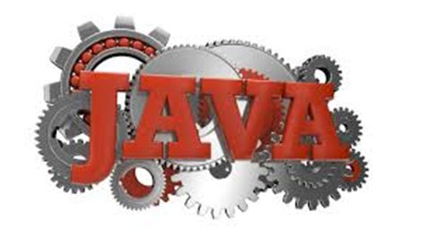
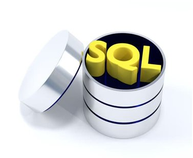
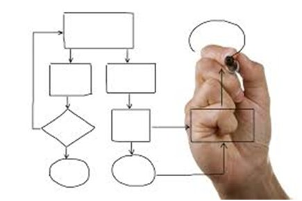
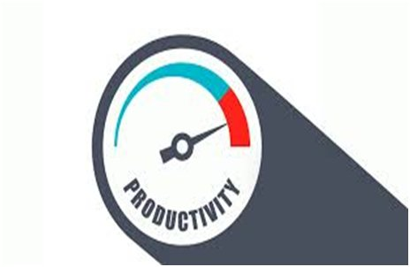

<h1 align="center"></h1>  

<h4 align="center">Java framework for enterprise web applications</h4>

Jacklyn Codebase is an open source full stack Java framework for developing business applications. It is a highly customizable and extensible component-based platform, designed and built from the ground up for developing high-performance production-ready enterprise web applications.

## One Structured Framework

Built on a single and well organized underlying framework that is designed for development in both small and large software projects. Easy to learn and adopt with the only major requirement being skilled in developing applications using Java programming language. No mishmash of technologies.

## Build Single-page Applications

Fluid user experience by creating responsive web applications without constant page reloads. Achieve this without writing a single line of JavaScript or HTML; Jacklyn Codebase handles the capability under the hood using AJAX and HTML5. Your applications are accessible over any standard modern web browser.

## Pre-built Functional Modules

No need to start your applications from scratch. Jacklyn Codebase provides common enterprise application features like User Management,  Role Management, Reporting, Workflow Management, Task Scheduling and User Activity Auditing which you can utilize out of the box.

## Automatic Schema Management

Build applications without bothering about writing or maintaining database scripts. Jacklyn Codebase has an in-built ORM mechanism with automatic SQL database schema management. Your web applications are truly database agnostic, allowing you to utilize any of the popular relational SQL databases.

## Integrated Report Engine

A configurable system that allows you to define reports with associated templates, input parameters and data sources. Users of your web application can perform static and ad hoc report generation in multiple report formats (PDF, Excel, CSV, etc).

## Business Process Workflow

Streamline your organization’s operational processes using software by creating corresponding workflow template definitions in your web applications. Jacklyn provides a configurable document and step-based workflow system that allows you to model virtually any business process.

## Productivity Tools

Expedite your project delivery using low-code productivity tools that allow your developers to generate end-to-end code from business domain objects and to design and evaluate workflow templates for business process management. Access tools for hot deploying your workflow definitions in real time.

